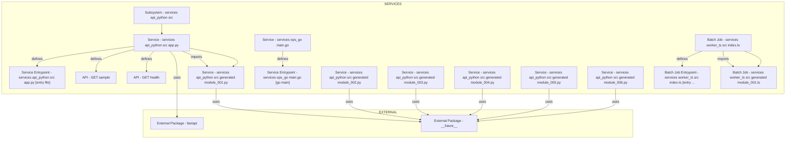
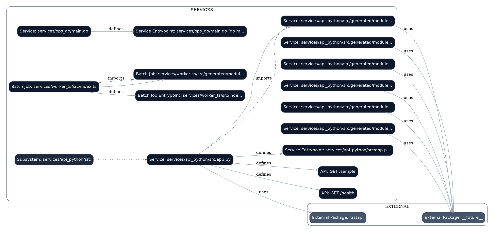

# Repository Analysis

## 1) High-level Repository Overview
- Repository scan captured 589 files across languages python:181, typescript:161, go:121, java:121, other:3, json:1, markdown:1. [Evidence: README.md#L1]
- Dominant implementation language appears to be python. [Evidence: README.md#L1]
- Deterministic fact index counts: files=589, endpoints=2, dependencies=2, scripts=0, sql_entities=0, sql_queries=0, cross_file_symbol_edges=2, cross_file_event_edges=0. [Evidence: README.md#L1]
- Structural extraction identified 182 Python symbols and 17 internal call relations. [Evidence: services/api_python/src/app.py#L7]
- Cross-language structural extraction identified 525 non-Python symbols; sample: java class Application, java method Application.health, java class Module001, java method Module001.compute. [Evidence: services/catalog_java/src/main/java/com/demo/Application.java#L3, services/catalog_java/src/main/java/com/demo/Application.java#L4, services/catalog_java/src/main/java/com/demo/generated/Module001.java#L3]
- Cross-file symbol graph resolved 2 symbol-level call edges; sample: services.api_python.src.app.sample -> services.api_python.src.generated.module_001.build_payload_001, sample -> buildPayload001. [Evidence: services/api_python/src/app.py#L12, services/worker_ts/src/index.ts#L8]
- Entrypoint candidates were detected using static patterns (conventional_entry_file, go_main). [Evidence: services/api_python/src/app.py#L1, services/ops_go/main.go#L3]
- Detected 2 API endpoint declarations from route patterns. [Evidence: services/api_python/src/app.py#L6, services/api_python/src/app.py#L10]
- Endpoint protocol mix includes http:2. [Evidence: services/api_python/src/app.py#L6, services/api_python/src/app.py#L10]

## 2) Summaries for Major Folders and Modules
- `services` contains 588 files (python:181, typescript:161, go:121, java:121); key symbols include Application, Application.health, Module001. [Evidence: services/api_python/requirements.txt#L1, services/catalog_java/src/main/java/com/demo/Application.java#L3, services/catalog_java/src/main/java/com/demo/Application.java#L4]
- `root` contains 1 files (markdown:1). [Evidence: README.md#L1]
- `services/api_python` contains 182 files (python:181, other:1); key symbols include app.health, app.sample, module_001.build_payload_001. [Evidence: services/api_python/requirements.txt#L1, services/api_python/src/app.py#L7, services/api_python/src/app.py#L11]
- `services/worker_ts` contains 162 files (typescript:161, json:1); key symbols include buildPayload001, buildPayload002, buildPayload003. [Evidence: services/worker_ts/package.json#L1, services/worker_ts/src/generated/module_001.ts#L1, services/worker_ts/src/generated/module_002.ts#L1]
- `services/catalog_java` contains 122 files (java:121, other:1); key symbols include Application, Application.health, Module001. [Evidence: services/catalog_java/pom.xml#L1, services/catalog_java/src/main/java/com/demo/Application.java#L3, services/catalog_java/src/main/java/com/demo/Application.java#L4]
- `services/ops_go` contains 122 files (go:121, other:1); key symbols include Compute001, Compute002, Compute003. [Evidence: services/ops_go/go.mod#L1, services/ops_go/internal/generated/module_001.go#L3, services/ops_go/internal/generated/module_002.go#L3]
- `services/api_python/src/app.py` is an entrypoint module; defines functions app.health, app.sample; invokes build_payload_001. [Evidence: services/api_python/src/app.py#L1, services/api_python/src/app.py#L7, services/api_python/src/app.py#L11]
- `services/api_python/src/generated/module_001.py` is an application module; defines functions module_001.build_payload_001. [Evidence: services/api_python/src/generated/module_001.py#L1, services/api_python/src/generated/module_001.py#L4, services/api_python/src/generated/module_001.py#L2]
- `services/api_python/src/generated/module_002.py` is an application module; defines functions module_002.build_payload_002. [Evidence: services/api_python/src/generated/module_002.py#L1, services/api_python/src/generated/module_002.py#L4, services/api_python/src/generated/module_002.py#L2]
- `services/api_python/src/generated/module_003.py` is an application module; defines functions module_003.build_payload_003. [Evidence: services/api_python/src/generated/module_003.py#L1, services/api_python/src/generated/module_003.py#L4, services/api_python/src/generated/module_003.py#L2]
- `services/api_python/src/generated/module_004.py` is an application module; defines functions module_004.build_payload_004. [Evidence: services/api_python/src/generated/module_004.py#L1, services/api_python/src/generated/module_004.py#L4, services/api_python/src/generated/module_004.py#L2]
- `services/api_python/src/generated/module_005.py` is an application module; defines functions module_005.build_payload_005. [Evidence: services/api_python/src/generated/module_005.py#L1, services/api_python/src/generated/module_005.py#L4, services/api_python/src/generated/module_005.py#L2]
- `services/api_python/src/generated/module_006.py` is an application module; defines functions module_006.build_payload_006. [Evidence: services/api_python/src/generated/module_006.py#L1, services/api_python/src/generated/module_006.py#L4, services/api_python/src/generated/module_006.py#L2]
- `services/api_python/src/generated/module_007.py` is an application module; defines functions module_007.build_payload_007. [Evidence: services/api_python/src/generated/module_007.py#L1, services/api_python/src/generated/module_007.py#L4, services/api_python/src/generated/module_007.py#L2]

## 3) Key Components and Dependencies
- Entrypoints include conventional_entry_file, go_main detection patterns. [Evidence: services/api_python/src/app.py#L1, services/ops_go/main.go#L3, services/worker_ts/src/index.ts#L1]
- Core Python components include app.health, app.sample, module_001.build_payload_001, module_002.build_payload_002. [Evidence: services/api_python/src/app.py#L7, services/api_python/src/app.py#L11, services/api_python/src/generated/module_001.py#L4]
- Core non-Python components include java Application, java Application.health, java Module001, java Module001.compute. [Evidence: services/catalog_java/src/main/java/com/demo/Application.java#L3, services/catalog_java/src/main/java/com/demo/Application.java#L4, services/catalog_java/src/main/java/com/demo/generated/Module001.java#L3]
- Import scan found 183 import references across 4 unique packages; local sample: none; external sample: fastapi, src.generated.module_001, ./generated/module_001. [Evidence: services/api_python/src/app.py#L1, services/api_python/src/app.py#L2, services/api_python/src/generated/module_001.py#L2]
- Import analysis suggests third-party runtime libraries may include fastapi, src. [Evidence: services/api_python/src/app.py#L1, services/api_python/src/app.py#L2, services/api_python/src/generated/module_001.py#L2]
- Dependency manifests expose 2 dependency entries; sample: fastapi, uvicorn. [Evidence: services/api_python/requirements.txt#L1, services/api_python/requirements.txt#L2]
- Runnable script definitions detected: 0. [Evidence: services/api_python/requirements.txt#L1, services/worker_ts/package.json#L1]
- Static endpoint extraction found 2 API endpoint declarations. [Evidence: services/api_python/src/app.py#L6, services/api_python/src/app.py#L10]

## 4) Execution and Data Flow
- Typical control path: `Service: services/api_python/src/app.py` -> `Service: services/api_python/src/generated/module_001.py`. [Evidence: services/api_python/src/app.py#L12, services/api_python/src/app.py#L1, services/api_python/src/generated/module_001.py#L1]
- `Service: services/api_python/src/app.py` uses `External Package: fastapi`. [Evidence: services/api_python/src/app.py#L1]
- `Service: services/api_python/src/app.py` defines `API: GET /health`. [Evidence: services/api_python/src/app.py#L6]
- `Service: services/api_python/src/app.py` defines `API: GET /sample`. [Evidence: services/api_python/src/app.py#L10]
- `Service: services/api_python/src/app.py` defines `Service Entrypoint: services/api_python/src/app.py [entry file]`. [Evidence: services/api_python/src/app.py#L1]
- `Service: services/api_python/src/app.py` invokes `Service: services/api_python/src/generated/module_001.py`. [Evidence: services/api_python/src/app.py#L12]
- `Service: services/api_python/src/app.py` imports `Service: services/api_python/src/generated/module_001.py`. [Evidence: services/api_python/src/app.py#L2]
- `Service: services/ops_go/main.go` defines `Service Entrypoint: services/ops_go/main.go [go main]`. [Evidence: services/ops_go/main.go#L3]
- `Batch Job: services/worker_ts/src/index.ts` defines `Batch Job Entrypoint: services/worker_ts/src/index.ts [entry file]`. [Evidence: services/worker_ts/src/index.ts#L1]

## 5) Endpoint Quality and Verification
- Endpoint extraction found 2 routes with 0 runtime-verified (0.0%) and 0 static-only. [Evidence: services/api_python/src/app.py#L6]
- Endpoint provenance mix: static_parse=2, cross_file_inference=0, runtime_observation=0. [Evidence: services/api_python/src/app.py#L6]
- Endpoint confidence mix: high=0, medium=2, low=0. [Evidence: services/api_python/src/app.py#L6]

## 6) Inference Insights (Deterministic)
- Inference: Repository likely exposes service/API runtime behavior. (confidence: low) Basis: Route declarations and startup signals were both detected. [Evidence: services/api_python/src/app.py#L6, services/api_python/src/app.py#L10, services/api_python/src/app.py#L1]
- Inference: Python runtime dependency footprint likely includes third-party libraries (sample: fastapi, src). (confidence: high) Basis: Python external import roots include non-stdlib package names. [Evidence: services/api_python/src/app.py#L1, services/api_python/src/app.py#L2, services/api_python/src/generated/module_001.py#L2]
- Inference: `Service: services/api_python/src/app.py` is a likely orchestration hotspot with fan-out 6. (confidence: high) Basis: Out-degree ranking on extracted structural graph identifies high fan-out orchestration points. [Evidence: services/api_python/src/app.py#L12, services/api_python/src/app.py#L2, services/api_python/src/app.py#L1]

### Inference Ledger (Claim / Type / Confidence / Evidence / Basis)
| Claim | Type | Confidence | Evidence | Basis |
|---|---|---|---|---|
| Repository likely exposes service/API runtime behavior. | inference | low | `services/api_python/src/app.py#L6`, `services/api_python/src/app.py#L10`, `services/api_python/src/app.py#L1` | Route declarations and startup signals were both detected. |
| Python runtime dependency footprint likely includes third-party libraries (sample: fastapi, src). | inference | high | `services/api_python/src/app.py#L1`, `services/api_python/src/app.py#L2`, `services/api_python/src/generated/module_001.py#L2` | Python external import roots include non-stdlib package names. |
| `Service: services/api_python/src/app.py` is a likely orchestration hotspot with fan-out 6. | inference | high | `services/api_python/src/app.py#L12`, `services/api_python/src/app.py#L2`, `services/api_python/src/app.py#L1` | Out-degree ranking on extracted structural graph identifies high fan-out orchestration points. |

## 7) Setup and Run Instructions (Inferred)
1. Primary run command(s): `python services/api_python/src/app.py`.
2. Alternative command: `go run services/ops_go/main.go`.
3. Alternative command: `tsx services/worker_ts/src/index.ts`.
4. Optional dynamic probe command: `python app.py`.
5. To generate architecture/documentation with this analyzer: `./run_agent.sh document --repo /path/to/repo --goal "architecture and dependencies" --mode deterministic`.

- Source snippets were pre-redacted with 0 replacements before analysis. [Evidence: README.md#L1]

## 8) Proposed Architecture Diagram (Mermaid)


## 9) Assumptions and Uncertainties
1. Startup commands are inferred from entrypoints because script manifests were not detected.
2. Dynamic runtime behavior and production infrastructure were not executed during this static scan.

## 10) Issues and Limitations Observed
1. Analysis is static (source and config inspection) and does not execute runtime code paths; behavior triggered only at runtime may be absent.
2. No files were skipped by size guard in this run (max_file_bytes=2097152).
3. Import-level analysis found 183 references, but dynamic import/reflection patterns can still evade static extraction.
4. Scan volume was 589 files / 2998101 characters; for larger codebases, increase resources and review per-run traceability artifacts.

## Key Files
- `README.md`: Documentation file included in the repository. [Evidence: README.md#L1]
- `services/api_python/requirements.txt`: Defines Python dependencies and packaging metadata. [Evidence: services/api_python/requirements.txt#L1]
- `services/api_python/src/app.py`: Likely entrypoint source file. [Evidence: services/api_python/src/app.py#L1]
- `services/api_python/src/generated/module_001.py`: Source code module included in the repository. [Evidence: services/api_python/src/generated/module_001.py#L1]
- `services/api_python/src/generated/module_002.py`: Source code module included in the repository. [Evidence: services/api_python/src/generated/module_002.py#L1]
- `services/api_python/src/generated/module_003.py`: Source code module included in the repository. [Evidence: services/api_python/src/generated/module_003.py#L1]
- `services/api_python/src/generated/module_004.py`: Source code module included in the repository. [Evidence: services/api_python/src/generated/module_004.py#L1]
- `services/api_python/src/generated/module_005.py`: Source code module included in the repository. [Evidence: services/api_python/src/generated/module_005.py#L1]
- `services/api_python/src/generated/module_006.py`: Source code module included in the repository. [Evidence: services/api_python/src/generated/module_006.py#L1]
- `services/api_python/src/generated/module_007.py`: Source code module included in the repository. [Evidence: services/api_python/src/generated/module_007.py#L1]
- `services/api_python/src/generated/module_008.py`: Source code module included in the repository. [Evidence: services/api_python/src/generated/module_008.py#L1]
- `services/api_python/src/generated/module_009.py`: Source code module included in the repository. [Evidence: services/api_python/src/generated/module_009.py#L1]
- `services/api_python/src/generated/module_010.py`: Source code module included in the repository. [Evidence: services/api_python/src/generated/module_010.py#L1]
- `services/api_python/src/generated/module_011.py`: Source code module included in the repository. [Evidence: services/api_python/src/generated/module_011.py#L1]
- `services/api_python/src/generated/module_012.py`: Source code module included in the repository. [Evidence: services/api_python/src/generated/module_012.py#L1]
- `services/api_python/src/generated/module_013.py`: Source code module included in the repository. [Evidence: services/api_python/src/generated/module_013.py#L1]
- `services/api_python/src/generated/module_014.py`: Source code module included in the repository. [Evidence: services/api_python/src/generated/module_014.py#L1]
- `services/api_python/src/generated/module_015.py`: Source code module included in the repository. [Evidence: services/api_python/src/generated/module_015.py#L1]
- `services/api_python/src/generated/module_016.py`: Source code module included in the repository. [Evidence: services/api_python/src/generated/module_016.py#L1]
- `services/api_python/src/generated/module_017.py`: Source code module included in the repository. [Evidence: services/api_python/src/generated/module_017.py#L1]
- 569 additional scanned files are not listed in this section; see `outputs/fact_index.json` for complete inventory. [Evidence: services/api_python/src/generated/module_018.py#L1]

## Architecture Graphviz (Detailed)


## Architecture LikeC4 (Detailed)
```likec4
model {
  n1 = system "External Package: __future__"
  n2 = system "External Package: fastapi"
  n3 = system "API: GET /health"
  n4 = system "API: GET /sample"
  n5 = system "Batch Job Entrypoint: services/worker_ts/src/inde..."
  n6 = system "Service Entrypoint: services/api_python/src/app.p..."
  n7 = system "Service Entrypoint: services/ops_go/main.go [go m..."
  n8 = system "Service: services/api_python/src/app.py"
  n9 = system "Service: services/api_python/src/generated/module..."
  n10 = system "Service: services/api_python/src/generated/module..."
  n11 = system "Service: services/api_python/src/generated/module..."
  n12 = system "Service: services/api_python/src/generated/module..."
  n13 = system "Service: services/api_python/src/generated/module..."
  n14 = system "Service: services/api_python/src/generated/module..."
  n15 = system "Service: services/ops_go/main.go"
  n16 = system "Batch Job: services/worker_ts/src/generated/modul..."
  n17 = system "Batch Job: services/worker_ts/src/index.ts"
  n18 = system "Subsystem: services/api_python/src"
  n8 -> n9 "calls"
  n17 -> n16 "calls"
  n8 -> n9 "imports"
  n17 -> n16 "imports"
  n8 -> n2 "uses"
  n8 -> n3 "defines"
  n8 -> n4 "defines"
  n8 -> n6 "defines"
  n18 -> n8 "contains"
  n17 -> n5 "defines"
  n15 -> n7 "defines"
  n9 -> n1 "uses"
  n10 -> n1 "uses"
  n11 -> n1 "uses"
  n12 -> n1 "uses"
  n13 -> n1 "uses"
  n14 -> n1 "uses"
}
```

## Deep Questions
1. Which dependency versions are pinned and what is the upgrade policy for the 2 detected dependencies?
2. What API authentication and authorization controls protect the 2 detected endpoints?
3. Which modules are most critical for incident response and how are they monitored?
4. What is the strategy for secrets rotation and least-privilege access across environments?
5. How are breaking changes detected before deployment for client and server contracts?
6. What minimum CI and infrastructure controls should be added for build, test, and release governance?
7. What test coverage exists for edge cases, failure paths, and data validation?
8. How is backward compatibility handled for legacy integrations and consumers?
9. If AI integrations are added later, what privacy and model-safety guardrails must be enforced by policy?
10. Which architectural decisions should be documented as ADRs for long-term maintainability?

## Quality Metrics

| Metric | Value |
| --- | --- |
| Factual bullet claims | 68 |
| Claims with valid line evidence | 68 |
| Claims with invalid evidence | 0 |
| Claims semantically supported by deterministic facts | 67 |
| Claims semantically unsupported by deterministic facts | 1 |
| Claims without evidence tags | 0 |
| Invalid evidence tokens | 0 |
| Unique evidence file paths | 32 |
| Invalid evidence paths | 0 |
| Unknown claims used | 0 |
| Unknown claims with [Evidence: none] | 0 |
| Unknown claims missing [Evidence: none] | 0 |
| Grounding profile | standard |
| Evidence coverage | 100.00% |
| Semantic claim coverage | 98.53% |
| Minimum semantic claim coverage required | 80.00% |
| Minimum claim support score required | 0.55 |
| Average semantic support score | 0.99 |
| Evidence file coverage | 5.43% |
| Scanned files with no evidence mention | 557 |
| Strict traceability enabled | False |
| Strict traceability pass | True |
| Semantic validation pass | True |
| Grounding gate pass | True |
| Redactions applied before LLM | 0 |
| Large files skipped by size guard | 0 |
| Default data classification | unclassified |
| Highest data classification | unclassified |
| Classified files | 589 |
| Files matched by classification rules | 0 |
Security policy: `default`
Classification counts: `{"unclassified": 589}`

Sample scanned files not mentioned by evidence:
services/api_python/src/generated/module_019.py, services/api_python/src/generated/module_020.py, services/api_python/src/generated/module_021.py, services/api_python/src/generated/module_022.py, services/api_python/src/generated/module_023.py, services/api_python/src/generated/module_024.py, services/api_python/src/generated/module_025.py, services/api_python/src/generated/module_026.py, services/api_python/src/generated/module_027.py, services/api_python/src/generated/module_028.py

Sample semantically unsupported claims:
569 additional scanned files are not listed in this section; see `outputs/fact_index.json` for complete inventory.
